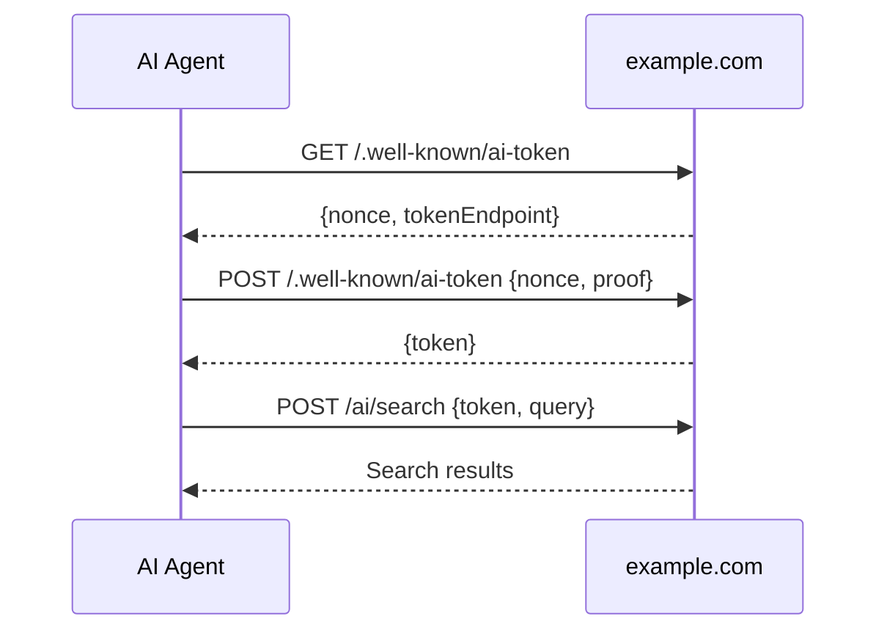

# Endpoint & Token Flows

This guide walks through how an agent securely interacts with an ARW-P enabled site.

## 1. Request a challenge
```bash
curl https://example.com/.well-known/ai-token
```
Response:
```json
{
  "nonce": "abc123",
  "tokenEndpoint": "https://example.com/.well-known/ai-token"
}
```

## 2. Sign the nonce and request a token
The agent signs the `nonce` with its private key and sends it back:
```bash
curl -X POST https://example.com/.well-known/ai-token \
  -H "Content-Type: application/json" \
  -d '{
        "nonce": "abc123",
        "proof": "<signature>"
      }'
```
Response:
```json
{
  "token": "<jwt>",
  "expiresIn": 3600
}
```

## 3. Call a documented endpoint
With the issued token, the agent can invoke endpoints advertised in `agents.json`.
```bash
curl https://example.com/ai/search \
  -H "Authorization: Bearer <jwt>" \
  -H "Content-Type: application/json" \
  -d '{"q": "coffee"}'
```


