# 🤖 ARW-P: Agent-Ready Web Protocol

<div align="center">

**The future-ready protocol that bridges AI agents and web services**

[](https://github.com/arwproject/arw-p)
[](LICENSE)
[]()

*Enabling seamless AI-to-web interactions without compromising human experiences*

</div>

---

## 🚀 What is ARW-P?

**ARW-P** (pronounced "R-Web-P") is an open standard protocol that empowers websites to expose dedicated, high-performance lanes for AI agents while preserving the optimal human user experience. Think of it as creating a "fast lane" for bots alongside the regular web traffic.

### 🎯 Key Benefits

<div class="benefits-grid">

**🔍 Structured Data**
- Reduces AI hallucinations with precise, typed responses
- Eliminates HTML parsing complexity
- Provides consistent, machine-readable formats

**⚡ Performance**
- 10x cheaper bandwidth compared to full HTML rendering
- Millisecond response times for agent queries
- Efficient token-based authentication

**🛡️ Security & Control**
- Documented, scoped API endpoints
- Rate limiting and access controls
- Audit trails for all agent interactions

**🌐 Universal Compatibility**
- Works alongside existing web infrastructure
- No changes to human-facing pages
- Progressive enhancement approach

</div>

---

## 🏗️ Architecture Overview

ARW-P creates a parallel interaction layer that coexists with your existing web presence:

```mermaid
graph TB
    subgraph "Traditional Web"
        Human[👤 Human User]
        Browser[🌐 Web Browser]
        HTML[📄 HTML Pages]
    end
    
    subgraph "ARW-P Layer"
        Agent[🤖 AI Agent]
        ARWEndpoints[⚡ ARW-P Endpoints]
        Discovery[🔍 Discovery Files]
    end
    
    subgraph "Your Website"
        Server[🖥️ Web Server]
        Database[(🗄️ Database)]
        API[🔌 Existing APIs]
    end
    
    Human --> Browser
    Browser --> HTML
    HTML --> Server
    
    Agent --> Discovery
    Agent --> ARWEndpoints
    ARWEndpoints --> Server
    
    Server --> Database
    Server --> API
    
    style Agent fill:#e1f5fe
    style ARWEndpoints fill:#f3e5f5
    style Discovery fill:#fff3e0
```



---

## 👥 Core Actors & Trust Model

| Actor | Role & Responsibilities |
|-------|------------------------|
| **🏢 Site Host** | • Publishes discovery files at `/.well-known/`<br>• Issues time-limited JWT tokens<br>• Defines available endpoints and scopes |
| **🤖 Agent Provider** | • Supplies cryptographic public keys<br>• Respects documented rate limits<br>• Follows endpoint specifications |
| **🌐 Edge Gateway** *(optional)* | • Provides additional authentication layers<br>• Implements advanced rate limiting<br>• Shapes and caches responses |
| **👤 Human Visitor** | • Continues using normal web interface<br>• Unaffected by agent interactions<br>• May benefit from agent-enhanced features |

---

## 📋 Required Components (v0.1)

### Core Discovery Files

| Endpoint | HTTP Method | Purpose | Required Fields |
|----------|-------------|---------|-----------------|
| `/.well-known/ai-token` | `GET` + `POST` | Token exchange & authentication | `nonce`, `tokenEndpoint` |
| `/.well-known/agents.json` | `GET` | Capability discovery | `specVersion`, `endpoints`, `scopes` |

### Content Endpoints

| Pattern | Purpose | Content Type |
|---------|---------|--------------|
| `/ai/<pageId>.json` | Page-specific structured data | `application/json` |
| `/ai/search` | Natural language search interface | `application/json` |
| `/ai/stream/*` *(optional)* | Real-time updates via Server-Sent Events | `text/event-stream` |

---

## 🎨 Implementation Examples

### Basic Discovery Configuration

Create your `/.well-known/agents.json`:

```json
{
  "$schema": "https://arw.dev/schemas/agents-0.1.json",
  "specVersion": "0.1",
  "meta": {
    "name": "My Website API",
    "description": "AI-friendly access to our content and services",
    "version": "1.0.0",
    "contact": {
      "email": "api@mywebsite.com",
      "url": "https://mywebsite.com/api-docs"
    }
  },
  "authentication": {
    "required": true,
    "schemes": ["bearer"],
    "tokenTtl": 3600
  },
  "rateLimits": {
    "default": {
      "requests": 100,
      "windowMs": 60000
    },
    "search": {
      "requests": 20,
      "windowMs": 60000
    }
  },
  "endpoints": [
    {
      "path": "/ai/search",
      "method": "POST",
      "scope": "search",
      "description": "Semantic search across site content",
      "parameters": {
        "q": {
          "type": "string",
          "required": true,
          "description": "Search query in natural language"
        },
        "limit": {
          "type": "integer",
          "default": 10,
          "max": 50
        }
      },
      "responseSchema": {
        "type": "object",
        "properties": {
          "results": {
            "type": "array",
            "items": {
              "type": "object",
              "properties": {
                "title": {"type": "string"},
                "url": {"type": "string"},
                "snippet": {"type": "string"},
                "relevance": {"type": "number"}
              }
            }
          }
        }
      }
    },
    {
      "path": "/ai/articles/{id}.json",
      "method": "GET",
      "scope": "content",
      "description": "Structured article content",
      "parameters": {
        "id": {
          "type": "string",
          "required": true,
          "description": "Article identifier"
        }
      }
    }
  ],
  "scopes": {
    "search": "Search site content and metadata",
    "content": "Access structured content data",
    "analytics": "Read aggregated usage statistics"
  }
}
```

### Search Endpoint Implementation

Example `/ai/search` response:

```json
{
  "query": "machine learning tutorials",
  "took": 23,
  "total": 127,
  "results": [
    {
      "id": "ml-intro-2024",
      "title": "Introduction to Machine Learning",
      "url": "/articles/machine-learning-intro",
      "snippet": "A comprehensive guide to getting started with ML concepts, algorithms, and practical applications.",
      "relevance": 0.95,
      "metadata": {
        "author": "Dr. Jane Smith",
        "publishDate": "2024-01-15",
        "tags": ["machine-learning", "tutorial", "beginner"],
        "readTime": "15 min"
      }
    },
    {
      "id": "deep-learning-guide",
      "title": "Deep Learning Best Practices",
      "url": "/articles/deep-learning-guide",
      "snippet": "Advanced techniques for building and training neural networks effectively.",
      "relevance": 0.87,
      "metadata": {
        "author": "Prof. Alex Johnson",
        "publishDate": "2024-02-03",
        "tags": ["deep-learning", "neural-networks", "advanced"],
        "readTime": "25 min"
      }
    }
  ],
  "facets": {
    "categories": [
      {"name": "Tutorials", "count": 45},
      {"name": "Research", "count": 32},
      {"name": "Tools", "count": 28}
    ],
    "difficulty": [
      {"name": "Beginner", "count": 67},
      {"name": "Intermediate", "count": 41},
      {"name": "Advanced", "count": 19}
    ]
  }
}
```

---

## 🔒 Security & Authentication Flow

```mermaid
sequenceDiagram
    participant Agent as 🤖 AI Agent
    participant Site as 🌐 Your Site
    participant Auth as 🔐 Auth Service
    
    Note over Agent,Auth: 1. Discovery Phase
    Agent->>Site: GET /.well-known/agents.json
    Site-->>Agent: Capabilities & requirements
    
    Note over Agent,Auth: 2. Authentication Phase
    Agent->>Site: GET /.well-known/ai-token
    Site-->>Agent: {"nonce": "abc123", "tokenEndpoint": "..."}
    
    Agent->>Agent: Sign nonce with private key
    Agent->>Site: POST /.well-known/ai-token<br/>{"nonce": "abc123", "proof": "<signature>"}
    Site->>Auth: Verify signature
    Auth-->>Site: ✅ Valid
    Site-->>Agent: {"token": "<jwt>", "expiresIn": 3600}
    
    Note over Agent,Auth: 3. API Usage Phase
    Agent->>Site: POST /ai/search<br/>Authorization: Bearer <jwt>
    Site->>Auth: Validate token
    Auth-->>Site: ✅ Valid + scope check
    Site-->>Agent: Search results
```



---

## 🛠️ Quick Start Guide

### 1. Setup Discovery Files

```bash
# Create the well-known directory
mkdir -p .well-known

# Add to your web server configuration
# Nginx example:
location /.well-known/ {
    add_header Access-Control-Allow-Origin *;
    add_header Content-Type application/json;
}
```

### 2. Implement Token Exchange

```javascript
// Example Node.js implementation
app.get('/.well-known/ai-token', (req, res) => {
    const nonce = generateSecureNonce();
    const challenge = {
        nonce,
        tokenEndpoint: 'https://yoursite.com/.well-known/ai-token',
        expiresAt: Date.now() + 300000 // 5 minutes
    };
    
    // Store nonce temporarily
    redis.setex(`nonce:${nonce}`, 300, JSON.stringify(challenge));
    
    res.json(challenge);
});

app.post('/.well-known/ai-token', async (req, res) => {
    const { nonce, proof } = req.body;
    
    // Verify the signature
    const isValid = await verifyAgentSignature(nonce, proof);
    
    if (isValid) {
        const token = jwt.sign(
            { scope: 'search,content', iat: Date.now() },
            JWT_SECRET,
            { expiresIn: '1h' }
        );
        
        res.json({ token, expiresIn: 3600 });
    } else {
        res.status(401).json({ error: 'Invalid signature' });
    }
});
```

### 3. Create Content Endpoints

```javascript
app.post('/ai/search', authenticateToken, (req, res) => {
    const { q, limit = 10 } = req.body;
    
    // Implement your search logic
    const results = searchContent(q, limit);
    
    res.json({
        query: q,
        took: 42,
        total: results.total,
        results: results.items.map(item => ({
            title: item.title,
            url: item.url,
            snippet: item.summary,
            relevance: item.score,
            metadata: {
                author: item.author,
                publishDate: item.date,
                tags: item.tags
            }
        }))
    });
});
```

---

## 📊 Use Cases & Examples

### E-commerce Integration

```json
{
  "endpoints": [
    {
      "path": "/ai/products/search",
      "method": "POST",
      "scope": "catalog",
      "description": "Search product catalog with natural language"
    },
    {
      "path": "/ai/products/{id}",
      "method": "GET", 
      "scope": "catalog",
      "description": "Get structured product information"
    },
    {
      "path": "/ai/inventory/check",
      "method": "POST",
      "scope": "inventory",
      "description": "Check real-time availability"
    }
  ]
}
```

### Content Management System

```json
{
  "endpoints": [
    {
      "path": "/ai/articles/search",
      "method": "POST",
      "scope": "content",
      "description": "Semantic article search"
    },
    {
      "path": "/ai/articles/{slug}",
      "method": "GET",
      "scope": "content", 
      "description": "Structured article content"
    },
    {
      "path": "/ai/categories",
      "method": "GET",
      "scope": "taxonomy",
      "description": "Content categorization data"
    }
  ]
}
```

### SaaS Platform

```json
{
  "endpoints": [
    {
      "path": "/ai/docs/search",
      "method": "POST",
      "scope": "documentation",
      "description": "Search API documentation and guides"
    },
    {
      "path": "/ai/status",
      "method": "GET",
      "scope": "monitoring",
      "description": "Service health and performance metrics"
    },
    {
      "path": "/ai/usage/{metric}",
      "method": "GET",
      "scope": "analytics",
      "description": "Usage statistics and trends"
    }
  ]
}
```

---

## 📈 Performance & Monitoring

### Response Time Targets

| Endpoint Type | Target Response Time | SLA |
|---------------|---------------------|-----|
| Discovery files | < 50ms | 99.9% |
| Token exchange | < 100ms | 99.5% |
| Search queries | < 200ms | 99.0% |
| Content retrieval | < 150ms | 99.5% |

### Monitoring Metrics

```javascript
// Example monitoring setup
const arwpMetrics = {
    requestCount: new Counter('arwp_requests_total'),
    responseTime: new Histogram('arwp_response_duration_ms'),
    errorRate: new Counter('arwp_errors_total'),
    tokenUsage: new Gauge('arwp_active_tokens')
};

app.use('/ai/*', (req, res, next) => {
    const start = Date.now();
    
    res.on('finish', () => {
        arwpMetrics.requestCount.inc({
            endpoint: req.path,
            method: req.method,
            status: res.statusCode
        });
        
        arwpMetrics.responseTime.observe(
            { endpoint: req.path },
            Date.now() - start
        );
    });
    
    next();
});
```

---

## 🔧 Advanced Configuration

### Rate Limiting Strategies

```json
{
  "rateLimits": {
    "perAgent": {
      "requests": 1000,
      "windowMs": 3600000,
      "scope": "global"
    },
    "perEndpoint": {
      "search": {
        "requests": 100,
        "windowMs": 60000
      },
      "content": {
        "requests": 500,
        "windowMs": 60000
      }
    },
    "burst": {
      "allowed": true,
      "maxBurst": 10,
      "replenishRate": 2
    }
  }
}
```

### Caching Configuration

```json
{
  "caching": {
    "discovery": {
      "ttl": 3600,
      "strategy": "immutable"
    },
    "search": {
      "ttl": 300,
      "strategy": "query-based",
      "varyBy": ["q", "limit", "scope"]
    },
    "content": {
      "ttl": 1800,
      "strategy": "etag",
      "revalidate": true
    }
  }
}
```

---

## 🤝 Community & Support

### Getting Help

- 📖 **Documentation**: [Full API Reference](flows.md)
- 💬 **Community Forum**: [ARW-P Discussions](https://github.com/arwproject/arw-p/discussions)
- 🐛 **Bug Reports**: [GitHub Issues](https://github.com/arwproject/arw-p/issues)
- 📧 **Email Support**: [contact@arw.dev](mailto:contact@arw.dev)

### Contributing

We welcome contributions! See our [Contributing Guide](CONTRIBUTING.md) for details on:

- 🔧 Code contributions
- 📝 Documentation improvements  
- 🧪 Testing and validation
- 💡 Feature proposals

### Roadmap

- **v0.2** - Enhanced streaming capabilities
- **v0.3** - Advanced authentication methods
- **v1.0** - Production stability guarantee

---

<div align="center">

**Ready to enable AI-native interactions on your website?**

[Get Started →](flows.md) • [View Examples →](https://github.com/arwproject/arw-p-examples) • [Join Community →](https://discord.gg/arwp)

---

*ARW-P is an open standard maintained by the community*

</div>
